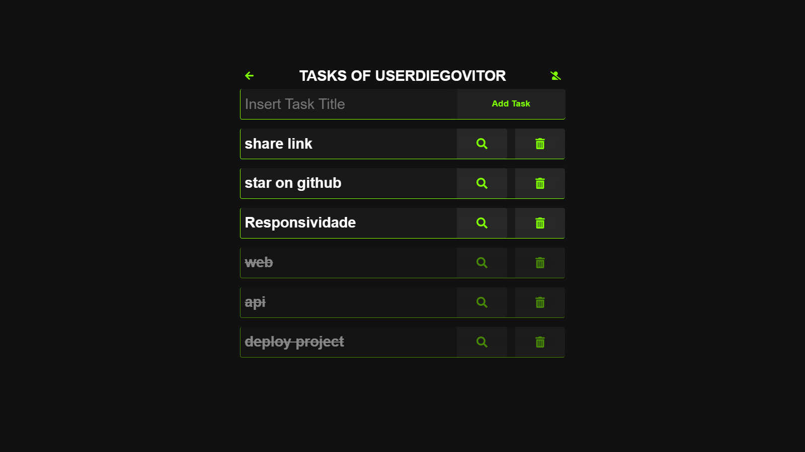
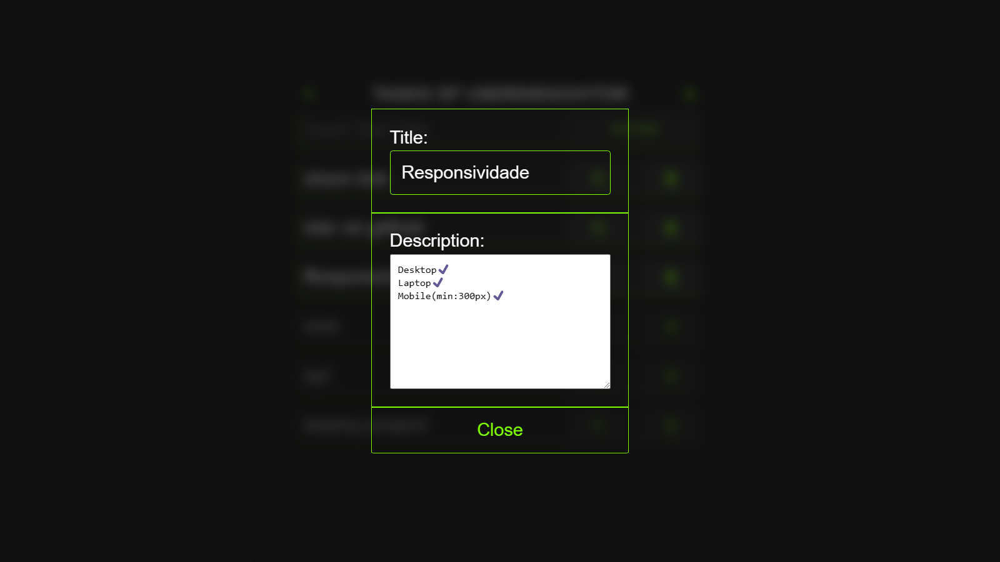
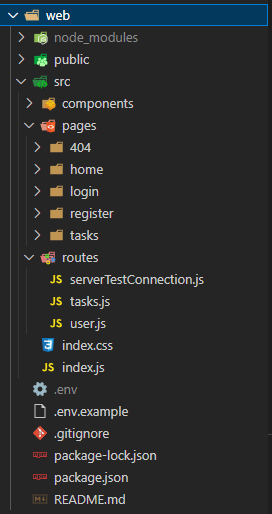
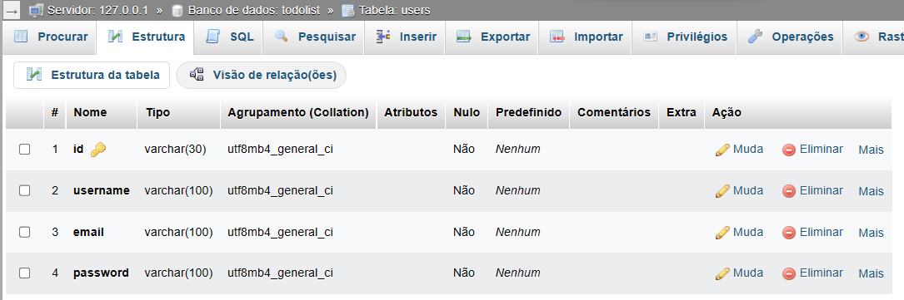
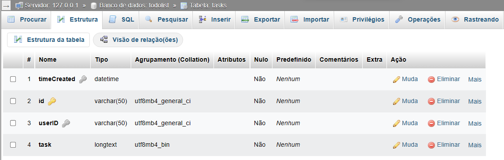
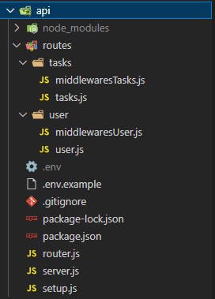

# to-do-list-fullstack

Este é um projeto de estudo, criando uma aplicação simulando um To-do List (Lista de tarefas) utilizando [React App](https://pt-br.reactjs.org/docs/create-a-new-react-app.html), [Xampp MySQL](https://www.apachefriends.org/pt_br/index.html) e [Express](https://expressjs.com/pt-br/).

## Frontend
Na pasta [./web](https://github.com/DiegoVitorGomesDias/to-do-list-fullstack/tree/master/web) encontra-se todo o Frontend do To-do List.

### Imagens representativas do APP:

Tela Principal:

Tela de Visualização e Edição de uma Task:

### Importante: Deploy
Durante o desenvolvimento do projeto, utilizei de um banco de dados local usando o [Xampp](https://www.apachefriends.org/pt_br/index.html), no qual foi previamente configurado por mim para o projeto. Mas como é um projeto de estudo, achei desnecessário ter um servidor e um banco de dados on-line para as requisições deste projeto. Portanto, realizei um update onde salva as tasks de cada usuário e a autenticação de login do mesmo no Local Storage do browser.

Entretanto não deletei os resquests para a API, assim, sempre antes de realizar um update, faço uma requisição verificando se a API está em pleno funcionamento dentro de uma url (.env: API_URL), se estiver é feito a requisição por ela, se não, é feito as mudanças no Local Storage.

### A organização dos arquivos foram feitas da seguinte forma:
- web
    - node_modules
        - ...
    - public
        - index.html
    - src
        - components
            -   tasks: contém todos os componentes individuais para a página de tasks.
        - pages: contém o home, login, register e as tasks.
        - routes: rotas de conexão com a API.
        - index.css
        - index.js: contém o roteamento para todas as páginas.
        - .env: API_URL=""

## Backend
Na pasta [./api](https://github.com/DiegoVitorGomesDias/to-do-list-fullstack/tree/master/api) encontra-se a estruturação da API e a coneção efetiva com o banco de dados do [Xampp](https://www.apachefriends.org/pt_br/index.html) usando MySQL.

### Banco de Dados MySql

### A organização dos arquivos foram feitas da seguinte forma:
- api
    - node_modules
        - ...
    - routes: todas as rotas da API.
        - tasks: middlewares e CRUD.
        - user:  middlewares e CRUD.
    - .env: HOST, USER, PASSWORD, DATABASE para conexão com o banco de dados do Xampp e JWT_KEY para criptografia do token.
    - router.js: contém o roteamento da API.
    - server.js: listen server app.
    - setup.js: app uses e configurações.

