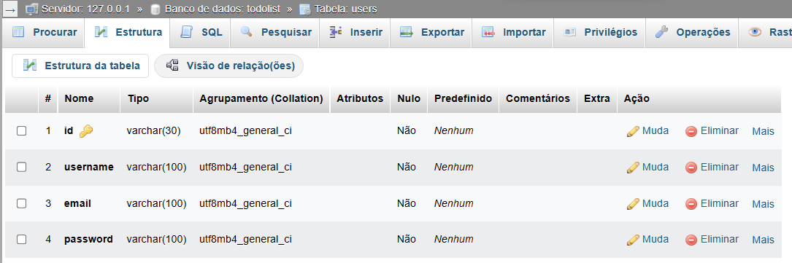

# Getting Started with Express

### `npm i`

### router.js
    import express from "express";
    const router = express.Router();

    import bodyParser from "body-parser";
    router.use(bodyParser.json());

    import cors from "cors";
    router.use(cors());

    router.get("/", (req, res) => res.status(200).json({Server: "Running"}));

### setup.js
    import express from "express";
    import router from "./router.js";

    const app = express();
    app.use(router);

    export default app;

### server.js
    import app from "./setup.js"
    const serverPort = 3500;

    app.listen(serverPort, () =>  console.log(`Server running on port ${serverPort}`));

## Available Scripts

In the project directory, you can run:

### `npm run dev`

Runs the app in the development mode.\
obs. for each update, restart the script\
Open [http://localhost:3500](http://localhost:3500) to view it in your browser.

## DataBase Connection

### .env

### Create DataBase on LocalHost using [Xampp](https://www.apachefriends.org/pt_br/index.html)

**Structures**

